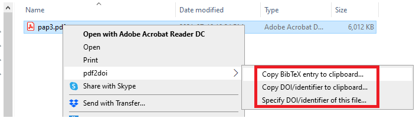
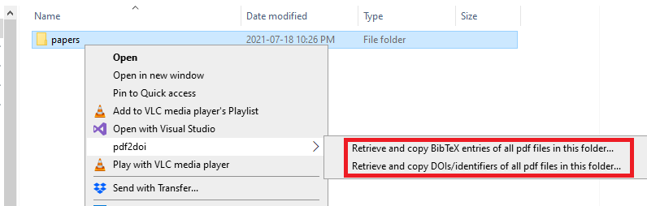

# pdf2doi 

pdf2doi is a Python library to automatically extract the DOI or other identifiers (e.g. arXiv ID) starting from the .pdf file of a publication 
(or from a folder containing several .pdf files), and to retrieve bibliographic information.
It exploits several methods (see below for detailed description) to find a valid identifier of a pdf file, and it validates any result
via web queries to public archives (e.g. http://dx.doi.org). 
The validation process also returns raw bibtex infos, which can be used for further processing, such as generating BibTeX entries ([pdf2bib](https://github.com/MicheleCotrufo/pdf2bib)) or
automatically rename the pdf files ([pdf-renamer](https://github.com/MicheleCotrufo/pdf-renamer)).

pdf2doi can be used either from [command line](#command-line-usage), or inside your [python script](#usage-inside-a-python-script) or, only for Windows, directly from the [right-click context menu](#installing-the-shortcuts-in-the-right-click-context-menu-of-windows) of a pdf file or a folder.

## Installation

Use the package manager pip to install pdf2doi.

```bash
pip install pdf2doi
```

Under Windows, it is also possible to add [shortcuts to the right-click context menu](#installing-the-shortcuts-in-the-right-click-context-menu-of-windows).

<!--

-->
[](https://pepy.tech/project/pdf2doi?versions=0.4&versions=0.5&versions=0.6&versions=1.0)[](https://pepy.tech/project/pdf2doi?versions=0.4&versions=0.5&versions=0.6&versions=1.0)
[](https://pypi.org/project/pdf2doi)
## Table of Contents
 - [Description](#description)
 - [Installation](#installation)
 - [Usage](#usage)
    * [Command line usage](#command-line-usage)
        + [Manually associate the correct identifier to a file from command line](#manually-associate-the-correct-identifier-to-a-file-from-command-line)
    * [Usage inside a python script](#usage-inside-a-python-script)
        + [Manually associate the correct identifier to a file](#manually-associate-the-correct-identifier-to-a-file)
 - [Installing the shortcuts in the right-click context menu of Windows](#installing-the-shortcuts-in-the-right-click-context-menu-of-windows)
  - [Contributing](#contributing)
 - [License](#license)

## Description
Automatically associating a DOI or other identifiers (e.g. arXiv ID) to a pdf file can be either a very easy or a very difficult
(sometimes nearly impossible) task, depending on how much care was placed in crafting the file. In the simplest case (which typically works with most recent publications)
it is enough to look into the file metadata. For older publications, the identifier is often found within the pdf text and it can be
extracted with the help of regular expressions. In the unluckiest cases, the only method left is to google some details of the publication
(e.g. the title or parts of the text) and hope that a valid identifier is contained in one of the first results.

The ```pdf2doi``` library applies sequentially all these methods (starting from the simplest ones) until a valid identifier is found and validated.
Specifically, for a given .pdf file it will, in order,

1. Look into the metadata of the .pdf file (extracted via the library [PyPDF2](https://github.com/mstamy2/PyPDF2)) and see if any string matches the pattern of 
a DOI or an arXiv ID. Priority is given to metadata which contain the word 'doi' in their label.

2. Check if the file name contains any sub-string that matches the pattern of 
a DOI or an arXiv ID.

3. Scan the text inside the .pdf file, and check for any string that matches the pattern of 
a DOI or an arXiv ID. The text is extracted with the libraries [PyPDF2](https://github.com/mstamy2/PyPDF2) and [textract](https://github.com/deanmalmgren/textract).

4. Try to find possible titles of the publication. In the current version, possible titles are identified via 
the library [pdftitle](https://github.com/metebalci/pdftitle "pdftitle"), and by the file name. For each possible title a google search 
is performed and the plain text of the first results is scanned for valid identifiers.

5. As a last desperate attempt, the first N=1000 characters of the pdf text are used as a query for
a google search. The plain text of the first results is scanned for valid identifiers.

Any time that a possible identifier is found, it is validated by performing a query to a relevant website (e.g., http://dx.doi.org for DOIs and http://export.arxiv.org for arxiv IDs). 
The validation process returns raw [bibtex](http://www.bibtex.org/) info when the identifier is valid. 

When a valid identifier is found with any method different than the first one, the identifier is stored inside the metadata of
the pdf file. In this way, future lookups of this same file will be able to extract the identifier with the 
first method, speeding up the search (This feature can be disabled by the user, in case edits to the pdf file are not desired).

The library is far from being perfect. Often, especially for old publications, none of the currently implemented methods will work. Other times the wrong DOI might be extracted: this can happen, for example, 
if the DOI of another paper is present in the pdf text and it appears before the correct DOI. A quick and dirty solution to this problem is to look up the identifier manually and then add it to the metadata
of the file, with the methods shown [here](#manually-associate-the-correct-identifier-to-a-file) (from python console) or [here](#manually-associate-the-correct-identifier-to-a-file-from-command-line) (from command line). 
In this way, ```pdf2doi``` will always retrieve the correct DOI in future requests, which can be useful for the generation of bibtex entries and for when ```pdf2doi```  is used 
for other bibliographic purposes.

Currently, only the format of arXiv identifiers in use after [1 April 2007](https://arxiv.org/help/arxiv_identifier) is supported.

## Usage

pdf2doi can be used either as a [stand-alone application](#command-line-usage) invoked from the command line, or by [importing it in your python project](#usage-inside-a-python-script) or, only for Windows, 
directly from the [right-click context menu](#installing-the-shortcuts-in-the-right-click-context-menu-of-windows) of a pdf file or a folder.

### Command line usage
```pdf2doi``` can be invoked directly from the command line, without having to open a python console.
The simplest command-line invokation is

```
$ pdf2doi 'path/to/target'
```
where ```target``` is either a valid pdf file or a directory containing pdf files. Adding the optional command '-v' increases the output verbosity,
documenting all steps.
For example, when targeting the folder [examples](/examples) we get the following output

```
$ pdf2doi ".\examples" -v
[pdf2doi]: Looking for pdf files in the folder D:\Dropbox (Personal)\PythonScripts\pdf2doi\examples...
[pdf2doi]: Found 4 pdf files.
[pdf2doi]: ................
[pdf2doi]: Trying to retrieve a DOI/identifier for the file: D:\Dropbox (Personal)\PythonScripts\pdf2doi\examples\1-s2.0-0021999186900938-main.pdf
[pdf2doi]: Method #1: Looking for a valid identifier in the document infos...
[pdf2doi]: Could not find a valid identifier in the document info.
[pdf2doi]: Method #2: Looking for a valid identifier in the file name...
[pdf2doi]: Could not find a valid identifier in the file name.
[pdf2doi]: Method #3: Looking for a valid identifier in the document text...
[pdf2doi]: Extracting text with the library PyPdf...
[pdf2doi]: Text extracted succesfully. Looking for an identifier in the text...
[pdf2doi]: Could not find a valid identifier in the document text extracted by PyPdf.
[pdf2doi]: Extracting text with the library textract...
[pdf2doi]: Text extracted succesfully. Looking for an identifier in the text...
[pdf2doi]: Could not find a valid identifier in the document text extracted by textract.
[pdf2doi]: Could not find a valid identifier in the document text.
[pdf2doi]: Method #4: Looking for possible publication titles...
[pdf2doi]: Found 2 possible title(s).
[pdf2doi]: Trying possible title #1
[pdf2doi]: Performing google search with key "An Efficient Numerical Evaluation of the Green’s Function for the Helmholtz Operator on Periodic Str ...[query too long, the remaining part is suppressed in the logging]"
[pdf2doi]: and looking at the first 6 results...
[pdf2doi]: Looking for a valid identifier in the search result #1 : https://www.sciencedirect.com/science/article/pii/0021999186900938
[pdf2doi]: Validating the possible DOI 10.1016/0021-9991(86)90093-8 via a query to dx.doi.org...
[pdf2doi]: The DOI 10.1016/0021-9991(86)90093-8 is validated by dx.doi.org.
[pdf2doi]: A valid DOI was found with this google search.
[pdf2doi]: Trying to write the identifier '10.1016/0021-9991(86)90093-8' into the metadata of the file 'D:\Dropbox (Personal)\PythonScripts\pdf2doi\examples\1-s2.0-0021999186900938-main.pdf'...
[pdf2doi]: The identifier '10.1016/0021-9991(86)90093-8' was added succesfully to the metadata of the file 'D:\Dropbox (Personal)\PythonScripts\pdf2doi\examples\1-s2.0-0021999186900938-main.pdf' with key '/identifier'...
[pdf2doi]: 10.1016/0021-9991(86)90093-8
[pdf2doi]: ................
[pdf2doi]: Trying to retrieve a DOI/identifier for the file: D:\Dropbox (Personal)\PythonScripts\pdf2doi\examples\chaumet_JAP_07.pdf
[pdf2doi]: Method #1: Looking for a valid identifier in the document infos...
[pdf2doi]: Could not find a valid identifier in the document info.
[pdf2doi]: Method #2: Looking for a valid identifier in the file name...
[pdf2doi]: Could not find a valid identifier in the file name.
[pdf2doi]: Method #3: Looking for a valid identifier in the document text...
[pdf2doi]: Extracting text with the library PyPdf...
[pdf2doi]: Text extracted succesfully. Looking for an identifier in the text...
[pdf2doi]: Validating the possible DOI 10.1063/1.2409490I.INTRODUCTION via a query to dx.doi.org...
[pdf2doi]: The DOI 10.1063/1.2409490I.INTRODUCTION is not valid according to dx.doi.org.
[pdf2doi]: Validating the possible DOI 10.1063/1.2409490I.INTRODUCTION via a query to dx.doi.org...
[pdf2doi]: The DOI 10.1063/1.2409490I.INTRODUCTION is not valid according to dx.doi.org.
[pdf2doi]: Validating the possible DOI 10.1063/1.2409490 via a query to dx.doi.org...
[pdf2doi]: The DOI 10.1063/1.2409490 is validated by dx.doi.org.
[pdf2doi]: A valid DOI was found in the document text.
[pdf2doi]: Trying to write the identifier '10.1063/1.2409490' into the metadata of the file 'D:\Dropbox (Personal)\PythonScripts\pdf2doi\examples\chaumet_JAP_07.pdf'...
[pdf2doi]: The identifier '10.1063/1.2409490' was added succesfully to the metadata of the file 'D:\Dropbox (Personal)\PythonScripts\pdf2doi\examples\chaumet_JAP_07.pdf' with key '/identifier'...
[pdf2doi]: 10.1063/1.2409490
[pdf2doi]: ................
[pdf2doi]: Trying to retrieve a DOI/identifier for the file: D:\Dropbox (Personal)\PythonScripts\pdf2doi\examples\PhysRevLett.116.061102.pdf
[pdf2doi]: Method #1: Looking for a valid identifier in the document infos...
[pdf2doi]: Could not find a valid identifier in the document info.
[pdf2doi]: Method #2: Looking for a valid identifier in the file name...
[pdf2doi]: Could not find a valid identifier in the file name.
[pdf2doi]: Method #3: Looking for a valid identifier in the document text...
[pdf2doi]: Extracting text with the library PyPdf...
[pdf2doi]: Text extracted succesfully. Looking for an identifier in the text...
[pdf2doi]: Validating the possible DOI 10.1103/PhysRevLett.116.061102 via a query to dx.doi.org...
[pdf2doi]: The DOI 10.1103/PhysRevLett.116.061102 is validated by dx.doi.org.
[pdf2doi]: A valid DOI was found in the document text.
[pdf2doi]: Trying to write the identifier '10.1103/PhysRevLett.116.061102' into the metadata of the file 'D:\Dropbox (Personal)\PythonScripts\pdf2doi\examples\PhysRevLett.116.061102.pdf'...
[pdf2doi]: The identifier '10.1103/PhysRevLett.116.061102' was added succesfully to the metadata of the file 'D:\Dropbox (Personal)\PythonScripts\pdf2doi\examples\PhysRevLett.116.061102.pdf' with key '/identifier'...
[pdf2doi]: 10.1103/PhysRevLett.116.061102
[pdf2doi]: ................
[pdf2doi]: Trying to retrieve a DOI/identifier for the file: D:\Dropbox (Personal)\PythonScripts\pdf2doi\examples\s41586-019-1666-5.pdf
[pdf2doi]: Method #1: Looking for a valid identifier in the document infos...
[pdf2doi]: Validating the possible DOI 10.1038/s41586-019-1666-5 via a query to dx.doi.org...
[pdf2doi]: The DOI 10.1038/s41586-019-1666-5 is validated by dx.doi.org.
[pdf2doi]: A valid DOI was found in the document info labelled '/doi'.
[pdf2doi]: 10.1038/s41586-019-1666-5
[pdf2doi]: ................
DOI             10.1016/0021-9991(86)90093-8             D:\Dropbox (Personal)\PythonScripts\pdf2doi\examples\1-s2.0-0021999186900938-main.pdf

DOI             10.1063/1.2409490                        D:\Dropbox (Personal)\PythonScripts\pdf2doi\examples\chaumet_JAP_07.pdf

DOI             10.1103/PhysRevLett.116.061102           D:\Dropbox (Personal)\PythonScripts\pdf2doi\examples\PhysRevLett.116.061102.pdf

DOI             10.1038/s41586-019-1666-5                D:\Dropbox (Personal)\PythonScripts\pdf2doi\examples\s41586-019-1666-5.pdf
```
Every line which begins with '[pdf2doi]' is omitted when the optional command '-v' is absent.
In the final output, the first column specifies the kind of identifier (currently either 'DOI' or 'arxiv'), the second column contains the found DOI/identifier, and the third column contains the file path.


A list of all optional arguments can be generated by ```pdf2doi --h```
```
$ pdf2doi --h
usage: pdf2doi [-h] [-v] [-nws] [-nwv] [-nostore] [-id IDENTIFIER] [-google GOOGLE_RESULTS] [-s FILENAME_IDENTIFIERS] [-clip] [-install--right--click] [-uninstall--right--click] [path [path ...]]

Retrieves the DOI or other identifiers (e.g. arXiv) from pdf files of a publications.

positional arguments:
  path                  Relative path of the target pdf file or of the targe folder.

optional arguments:
  -h, --help            show this help message and exit
  -v, --verbose         Increase verbosity. By default (i.e. when not using -v), only a table with the found identifiers will be printed as output.
  -nws, --no_web_search
                        Disable any method to find identifiers which requires internet searches (e.g. queries to google).
  -nwv, --no_web_validation
                        Disable the online validation of identifiers (e.g., via queries to http://dx.doi.org/).
  -nostore, --no_store_identifier_metadata
                        By default, anytime an identifier is found it is added to the metadata of the pdf file (if not present yet). By using this additional option, the identifier is not stored in the file metadata.
  -id IDENTIFIER        Stores the string IDENTIFIER in the metadata of the target pdf file, with key '/identifier'. Note: when this argument is passed, all other arguments (except for the path to the pdf file) are ignored.
  -google GOOGLE_RESULTS
                        Set how many results should be considered when doing a google search for the DOI (default=6).
  -s FILENAME_IDENTIFIERS, --save_identifiers_file FILENAME_IDENTIFIERS
                        Save all the identifiers found in the target folder in a text file inside the same folder with name specified by FILENAME_IDENTIFIERS. This option is only available when a folder is targeted.
  -clip, --save_doi_clipboard
                        Store all found DOI/identifiers into the clipboard.
  -install--right--click
                        Add a shortcut to pdf2doi in the right-click context menu of Windows. You can copy the identifier and/or bibtex entry of a pdf file (or all pdf files in a folder) into the clipboard by just right clicking on it!
                        NOTE: this feature is only available on Windows.
  -uninstall--right--click
                        Uninstall the right-click context menu functionalities. NOTE: this feature is only available on Windows.
```

#### Manually associate the correct identifier to a file from command line
Sometimes it is not possible to retrieve a DOI/identifier automatically, or maybe the one that is retrieved is not the correct one. In these (hopefully rare) occasions
it is possible to manually add the correct DOI/identifier to the pdf metadata, by using the ```-id``` argument,
```
$ pdf2doi "path\to\pdf" -id "identifier"
```
This creates a new metadata in the pdf file with label '/identifier' and containing the string ```identifier```.  Future lookups of this same file via ```pdf2doi``` will 
then return the correct identifier.

### Usage inside a python script
```pdf2doi``` can also be used as a library within a python script. The function ```pdf2doi.pdf2doi``` is the main point of entry. The function looks for the identifier of a pdf file by applying all the available methods. 
The first input argument must be a valid path (either absolute or relative) to a pdf file or to a folder containing pdf files. 
The same settings available in the command line operation, are not available via the methods ```set``` and ```get``` of the object ```pdf2doi.config```
For example, we can scan the folder [examples](/examples), while keeping reducing the output verbosity, 

```python
>>> from pdf2doi import pdf2doi
>>> pdf2doi.config.set('verbose',False)
>>> results = pdf2doi('.\examples')
```

The output of the function ```pdf2doi``` is a list of dictionaries (or just a single dictionary if a single file was targeted). Each dictionary has the following keys

```
result['identifier'] = DOI or other identifier (or None if nothing is found)
result['identifier_type'] = string specifying the type of identifier (e.g. 'doi' or 'arxiv')
result['validation_info'] = Additional info on the paper. If config.get('webvalidation') = True, then result['validation_info']
                            will typically contain raw bibtex data for this paper. Otherwise it will just contain True 
result['path'] = path of the pdf file
result['method'] = method used to find the identifier
```
For example, the DOIs/identifiers of each file can be printed by
```
>>> for result in results:
>>>     print(result['identifier'])
10.1016/0021-9991(86)90093-8
10.1063/1.2409490
10.1103/PhysRevLett.116.061102
10.1038/s41586-019-1666-5
```
A list of all possible settings, together with their current value, is obtainable via
```python
>>> from pdf2doi import pdf2doi
>>> pdf2doi.config.print()
verbose : False (bool)
separator : \ (str)
method_dxdoiorg : application/citeproc+json (str)
webvalidation : True (bool)
websearch : True (bool)
numb_results_google_search : 6 (int)
N_characters_in_pdf : 1000 (int)
save_identifier_metadata : True (bool)
```
By default, everytime that a valid DOI/identifier is found, it is stored in the metadata of the pdf file. In this way, subsequent lookups of the same folder/file will be much faster.
This behaviour can be removed (e.g. if the user does not want or cannot edit the files) by setting save_identifier_metadata to False, via
```python
>>> pdf2doi.config.set('save_identifier_metadata',False)
```

#### Manually associate the correct identifier to a file
Similarly to what described [above](#manually-associate-the-correct-identifier-to-a-file-from-command-line), it is possible to associate a (manually found) 
identifier to a pdf file also from within python, by using the function ```pdf2doi.add_found_identifier_to_metadata```:

```python
>>> import pdf2doi
>>> pdf2doi.add_found_identifier_to_metadata(path_to_pdf_file, identifier)
```
this creates a new metadata in the pdf file with label '/identifier' and containing the string ```identifier```.  

## Installing the shortcuts in the right-click context menu of Windows
This functionality is only available on Windows (and so far it has been tested only on Windows 10). It adds additional commands to the context menu of Windows
which appears when right-clicking on a pdf file or on a folder.
<!--

-->
The different menu commands allow to copy the paper(s) identifier(s) into the system clipboard, or also to manually
set the identifier of a pdf file (see also [here](#manually-associate-the-correct-identifier-to-a-file-from-command-line)).
<!--

-->
To install this functionality, first install ```pdf2doi``` via pip (as described above), then open a command prompt **with administrator rights** and execute
```
$ pdf2doi  -install--right--click
```
To remove it, simply run (again from a terminal with administrator rights)
```
$ pdf2doi  -uninstall--right--click
```
If it is not possible to run this command from a terminal with administrator rights, the batch files
[here](/right_click_menu_installation) can be alternatively used (see readme.MD file in the same folder for instructions), although it is still required to have 
admnistrator rights.

NOTE: when multiple pdf files are selected, and the right-click context menu commands are used, ```pdf2doi``` will be called separately for each file, and thus
only the info of the last file will be stored in the clipboard. In order to copy the info of multiple files it is necessary to save them in a folder and right-click on the folder.


## Contributing
Pull requests are welcome. For major changes, please open an issue first to discuss what you would like to change.


## License
[MIT](https://choosealicense.com/licenses/mit/)
